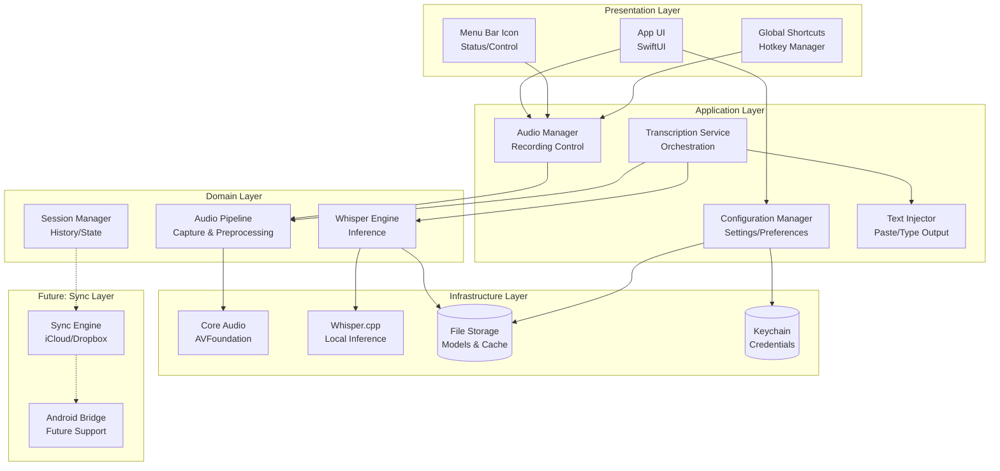
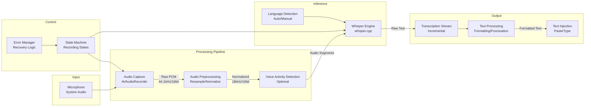
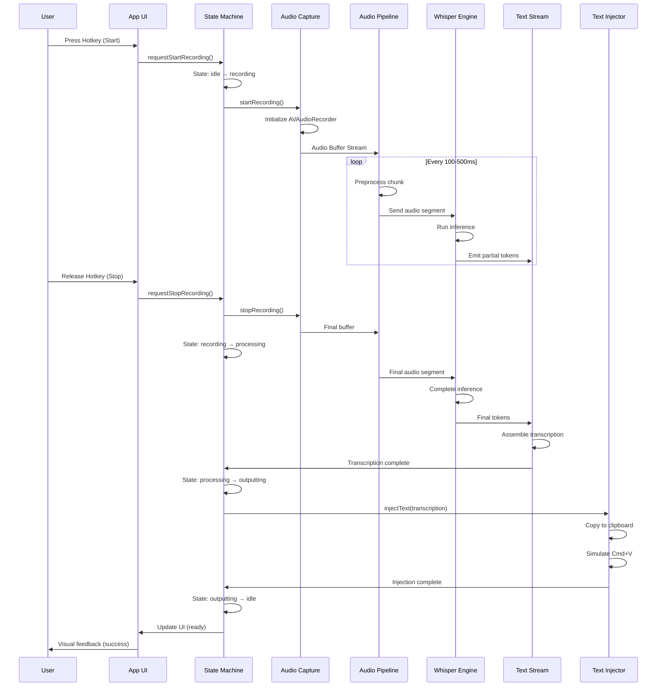
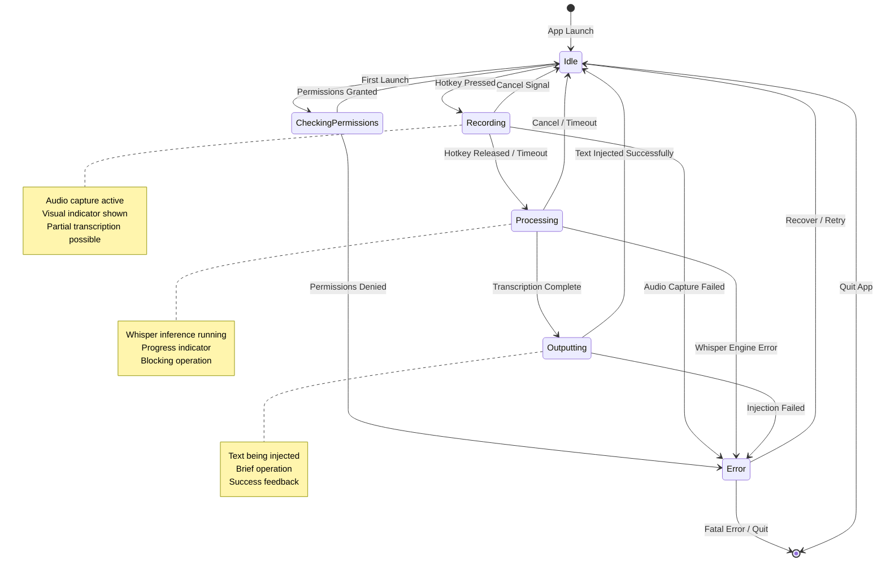
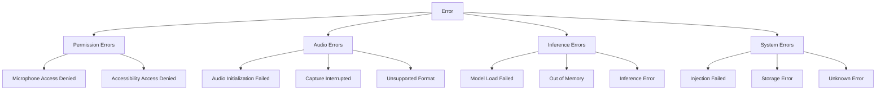
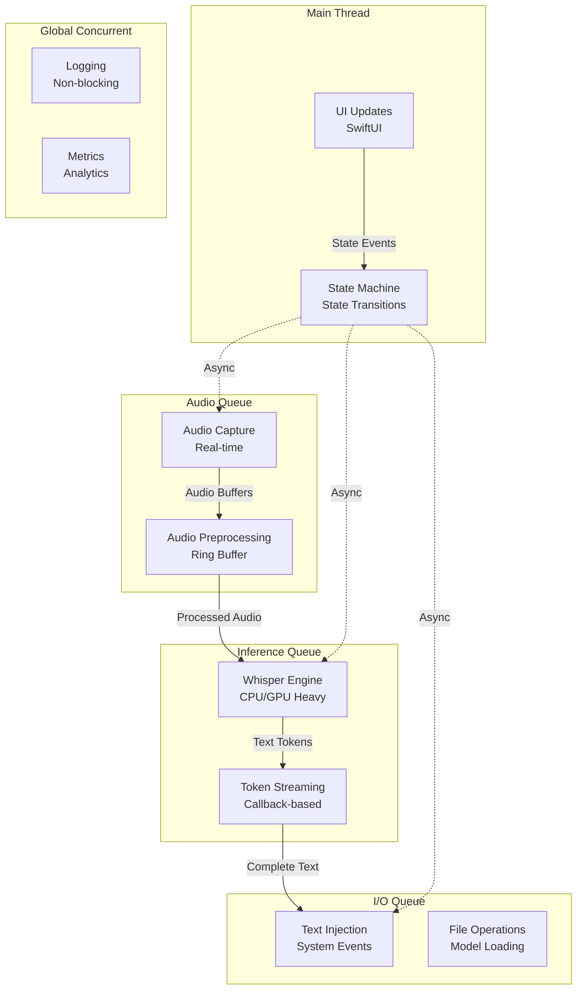
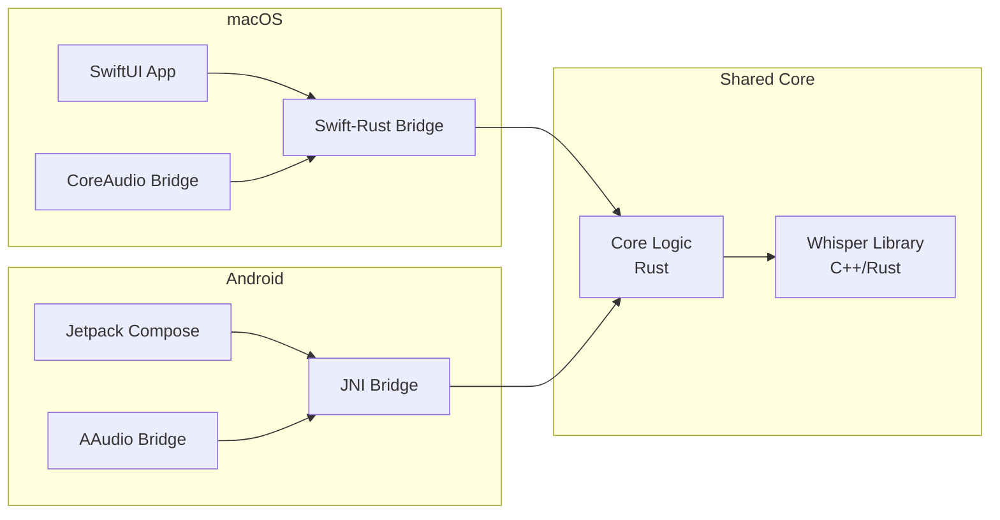

# Speakr Alternative - System Architecture Design

## Overview

This document defines the system architecture for a local-first Whisper-based transcription application for macOS, with future extensibility for Android and cross-device synchronization.

---

## 1. High-Level Architecture



### Architecture Pattern: Clean Architecture / Layered Architecture

The system follows a layered architecture with clear separation of concerns:

| Layer | Responsibility | Technology |
|-------|---------------|------------|
| Presentation | User interface, visual feedback | SwiftUI, AppKit |
| Application | Use cases, workflow orchestration | Swift (async/await) |
| Domain | Business logic, audio processing | Swift, AudioToolbox |
| Infrastructure | External systems, hardware | CoreAudio, Whisper.cpp |
| Future: Sync | Cross-device synchronization | CloudKit, FileProvider |

---

## 2. Component Diagram



### Component Responsibilities

| Component | Input | Output | Responsibility |
|-----------|-------|--------|----------------|
| Audio Capture | Microphone stream | Raw PCM buffer | Capture system audio with configurable quality |
| Audio Preprocessing | Raw PCM | Normalized audio | Resample to 16kHz, normalize levels, noise reduction |
| Voice Activity Detection | Audio buffer | Speech segments | Detect voice vs silence (optional, reduces compute) |
| Whisper Engine | Audio segments | Text tokens | Run whisper.cpp inference with configured model |
| Transcription Stream | Text tokens | Complete sentences | Buffer tokens, emit finalized text |
| Text Processing | Raw text | Formatted text | Apply formatting rules, punctuation fixes |
| Text Injection | Formatted text | OS text input | Simulate paste or keystroke injection |
| State Machine | User actions, events | State transitions | Manage recording lifecycle |
| Error Manager | Errors from any stage | Recovery actions | Handle and recover from failures |

---

## 3. Data Flow Diagram



### Data Transformation Stages

| Stage | Data Format | Size/Rate | Processing |
|-------|-------------|-----------|------------|
| Raw Capture | PCM 44.1kHz, 16-bit | ~86 KB/s | Direct from microphone |
| Preprocessed | PCM 16kHz, 16-bit | ~32 KB/s | Resampled, normalized |
| Whisper Input | Float32 array | 16k samples/sec | Normalized to [-1, 1] |
| Whisper Output | Token stream | Variable | Word-level timestamps |
| Final Text | UTF-8 string | Variable | Punctuation applied |

---

## 4. Module Boundaries and Interfaces

### Module Structure

```
Speakr/
├── Presentation/
│   ├── MenuBarController      # Menulet, status icon
│   ├── RecordingView          # Recording overlay/window
│   ├── SettingsView           # Preferences UI
│   └── ShortcutManager        # Global hotkey handling
├── Application/
│   ├── RecordingCoordinator   # Recording session orchestration
│   ├── TranscriptionWorkflow  # End-to-end transcription flow
│   ├── SettingsService        # User preferences management
│   └── PermissionManager      # Mic/accessibility permissions
├── Domain/
│   ├── Audio/
│   │   ├── AudioRecorder      # Recording interface
│   │   ├── AudioProcessor     # Preprocessing pipeline
│   │   └── AudioBuffer        # Audio data structures
│   ├── Transcription/
│   │   ├── WhisperEngine      # Inference wrapper
│   │   ├── TranscriptionSession
│   │   └── TextFormatter      # Post-processing
│   └── Models/
│       ├── TranscriptionResult
│       ├── RecordingSession
│       └── AppConfiguration
└── Infrastructure/
    ├── Audio/
    │   └── CoreAudioRecorder  # AVFoundation implementation
    ├── Whisper/
    │   └── WhisperCppWrapper  # whisper.cpp binding
    ├── Storage/
    │   ├── FileStorage        # Local file operations
    │   └── KeychainStorage    # Secure storage
    └── System/
        ├── TextInjector       # Paste/keystroke simulation
        └── AccessibilityHelper
```

### Public Interfaces

#### AudioRecorder Protocol
```swift
protocol AudioRecorder {
    var state: AudioRecorderState { get }
    var audioStream: AsyncStream<AudioBuffer> { get }
    
    func start() async throws
    func stop() async
    func configure(_ config: AudioConfiguration) async
}

enum AudioRecorderState {
    case idle, preparing, recording, stopping, error(AudioError)
}
```

#### WhisperEngine Protocol
```swift
protocol WhisperEngine {
    var isModelLoaded: Bool { get }
    var partialResults: AsyncStream<TranscriptionSegment> { get }
    
    func loadModel(_ model: WhisperModel) async throws
    func transcribe(audio: AudioBuffer) async throws -> TranscriptionResult
    func transcribeStream(audioStream: AsyncStream<AudioBuffer>) async throws
    func stop() async
}

struct TranscriptionResult {
    let text: String
    let segments: [TranscriptionSegment]
    let language: String
    let duration: TimeInterval
}
```

#### TextInjector Protocol
```swift
protocol TextInjector {
    func inject(_ text: String, method: InjectionMethod) async throws
}

enum InjectionMethod {
    case paste           // Simulate Cmd+V
    case type           // Simulate keystrokes
    case clipboardOnly  // Just copy to clipboard
}
```

#### StateMachine Interface
```swift
protocol RecordingStateMachine {
    var currentState: RecordingState { get }
    var stateStream: AsyncStream<RecordingState> { get }
    
    func transition(to event: StateEvent) async throws
}

enum RecordingState {
    case idle
    case recording(startTime: Date)
    case processing(audioData: AudioData)
    case outputting(transcription: TranscriptionResult)
    case error(StateError)
}
```

---

## 5. State Machine Diagram



### State Transitions Table

| Current State | Event | Next State | Actions |
|---------------|-------|------------|---------|
| Idle | Hotkey Press | Recording | Start audio capture, show UI |
| Idle | Settings Open | Idle | Show settings window |
| Recording | Hotkey Release | Processing | Stop capture, start transcription |
| Recording | Timeout | Processing | Auto-stop after max duration |
| Recording | Cancel | Idle | Discard recording, cleanup |
| Processing | Success | Outputting | Format text, prepare injection |
| Processing | Failure | Error | Log error, notify user |
| Outputting | Success | Idle | Cleanup, show success |
| Outputting | Failure | Error | Log error, copy to clipboard fallback |
| Error | Retry | Previous | Attempt recovery |
| Error | Dismiss | Idle | Clear error state |

---

## 6. Error Handling Strategy

### Error Classification



### Error Handling Patterns

| Error Type | Severity | User Action | Fallback Behavior |
|------------|----------|-------------|-------------------|
| Microphone Denied | Fatal | Grant in System Preferences | Show instructions, disable recording |
| Accessibility Denied | Warning | Grant in System Preferences | Fallback to clipboard-only mode |
| Audio Init Failed | Recoverable | Retry | Show error, return to idle |
| Capture Interrupted | Recoverable | Retry | Auto-restart if possible |
| Model Load Failed | Fatal | Reinstall app | Show error dialog, quit |
| Out of Memory | Recoverable | Close other apps | Use smaller model, retry |
| Inference Error | Recoverable | Retry | Discard audio, return to idle |
| Injection Failed | Recoverable | Manual paste | Copy to clipboard, notify user |

### Error Recovery Flow

```swift
enum ErrorRecoveryStrategy {
    case immediate          // Auto-retry once
    case exponentialBackoff // Retry with delays
    case fallback           // Use alternative method
    case userIntervention   // Show dialog, wait for user
    case fatal              // Log and quit
}

protocol ErrorHandler {
    func handle(_ error: AppError, context: ErrorContext) -> ErrorRecoveryStrategy
    func recover(from error: AppError) async -> Bool
}
```

### Resilience Patterns

1. **Circuit Breaker**: If Whisper fails N times, temporarily switch to fallback mode
2. **Retry with Backoff**: Transient errors retry with exponential delays (100ms, 200ms, 400ms)
3. **Graceful Degradation**: If text injection fails, always fallback to clipboard
4. **Partial Results**: Even on error, return any transcribed text to user

---

## 7. Thread Model and Concurrency

### Concurrency Architecture



### Thread/Queue Assignments

| Component | Queue | QoS | Reason |
|-----------|-------|-----|--------|
| UI Updates | Main | User Interactive | SwiftUI requirement |
| State Machine | Main | User Initiated | Coordinates all operations |
| Audio Capture | Dedicated Audio | User Initiated | Real-time requirements |
| Audio Preprocessing | Concurrent | User Initiated | Keep up with real-time |
| Whisper Inference | Dedicated ML | Utility | CPU-intensive, can lag |
| Text Injection | Main | User Initiated | Accessibility API requirement |
| File I/O | Background | Background | Non-blocking operations |
| Logging | Concurrent | Background | Don't block main flow |

### Concurrency Patterns

#### Audio Pipeline (Producer-Consumer)
```swift
actor AudioPipeline {
    private let audioStream: AsyncStream<AudioBuffer>
    private let processedStream: AsyncStream<ProcessedAudio>
    
    func process() async {
        for await buffer in audioStream {
            let processed = await preprocess(buffer)
            await whisperEngine.consume(processed)
        }
    }
}
```

#### Whisper Inference (Actor Isolation)
```swift
actor WhisperEngine {
    private var context: WhisperContext?
    private var isProcessing = false
    
    func transcribe(_ audio: ProcessedAudio) async throws -> TranscriptionResult {
        guard !isProcessing else { throw .alreadyProcessing }
        isProcessing = true
        defer { isProcessing = false }
        
        return try await runInference(audio)
    }
}
```

#### State Machine (Main Actor)
```swift
@MainActor
class RecordingStateMachine: ObservableObject {
    @Published var state: RecordingState = .idle
    
    func transition(to event: StateEvent) async throws {
        // All state transitions on main thread
        // Coordinate async work on other queues
    }
}
```

### Synchronization Points

1. **Audio Buffer Ring**: Lock-free ring buffer between capture and preprocessing
2. **Transcription Queue**: Serialized access to Whisper engine (single inference at a time)
3. **State Access**: All state reads/writes through StateMachine actor
4. **Model Loading**: Exclusive access during model initialization

### Concurrency Safety Rules

1. Never block the audio capture thread
2. Whisper inference can be slow; emit partial results progressively
3. All UI updates on MainActor
4. Use Swift concurrency (async/await) throughout
5. Avoid locks; prefer actors and structured concurrency

---

## 8. Future Considerations

### Android Support Architecture



### Sync Architecture (Future)

```mermaid
flowchart TB
    subgraph "Device A (Mac)"
        ALocal[(Local DB<br/>SQLite)]
        AEngine[Sync Engine]
    end

    subgraph "Cloud"
        Cloud[CloudKit / iCloud]
    end

    subgraph "Device B (Android)"
        BLocal[(Local DB<br/>Room)]
        BEngine[Sync Engine]
    end

    ALocal <--> AEngine
    AEngine <--> Cloud
    Cloud <--> BEngine
    BEngine <--> BLocal
```

---

## 9. Technology Stack Summary

| Component | Technology | Alternative |
|-----------|------------|-------------|
| UI Framework | SwiftUI | AppKit (fallback) |
| Audio Capture | AVFoundation | Core Audio (advanced) |
| Whisper Engine | whisper.cpp | Core ML conversion |
| Hotkeys | NSEvent/GlobalMonitor | CGEventTap |
| Text Injection | AXUIElement | AppleScript |
| Persistence | UserDefaults + Files | Core Data |
| Concurrency | Swift Concurrency | Combine |
| Testing | XCTest | Swift Testing |

---

## 10. Security Considerations

1. **Local-First**: All audio processing on-device; no cloud transcription
2. **Sandboxing**: Minimal entitlements; microphone and accessibility only
3. **Data Retention**: Configurable history; auto-delete after N days
4. **Clipboard**: Clear sensitive transcriptions from clipboard after timeout

---

## Appendix: File Organization

```
speakr/
├── Speakr/
│   ├── App/
│   │   └── SpeakrApp.swift
│   ├── Presentation/
│   │   ├── MenuBar/
│   │   ├── Recording/
│   │   └── Settings/
│   ├── Application/
│   │   ├── Services/
│   │   └── Coordinators/
│   ├── Domain/
│   │   ├── Audio/
│   │   ├── Transcription/
│   │   └── Models/
│   └── Infrastructure/
│       ├── Audio/
│       ├── Whisper/
│       ├── Storage/
│       └── System/
├── SpeakrTests/
└── SpeakrUITests/
```
